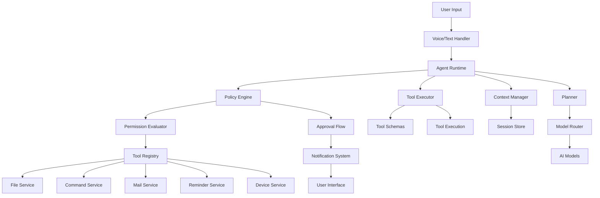

# Jarvis - Personal Assistance Desktop App Architecture

## Overview
Jarvis is a comprehensive personal assistant desktop application that runs continuously, listening for commands and managing various system tools with appropriate permission controls. The architecture follows a modular design pattern similar to the ollama-agent but adapted for desktop applications.

## Core Components

### 1. Agent Core
- **Agent Runtime**: Main execution engine that orchestrates all components
- **Context Manager**: Manages conversation context and state
- **Planner**: Determines next steps based on user input and current context
- **Model Router**: Routes requests to appropriate AI models

### 2. Permission & Policy System
- **Policy Engine**: Evaluates tool usage against defined policies
- **Permission Evaluator**: Makes decisions on whether to allow, ask for approval, or deny actions
- **Approval Flow**: Handles user approval requests for potentially risky operations
- **Risk Classifier**: Categorizes tools and commands by risk level

### 3. Tool System
- **Tool Registry**: Central registry of available tools with metadata
- **Tool Executor**: Executes registered tools with proper parameter handling
- **Tool Schemas**: Defines tool interfaces and expected parameters

### 4. User Interface
- **Desktop UI**: Main interface for interaction (could be tray app, windowed app, or both)
- **Notification System**: For alerts, approvals, and status updates
- **Voice Input Handler**: For listening and processing voice commands

### 5. Service Layer
- **File Service**: File system operations with permission controls
- **Command Service**: Execution of system commands with safety measures
- **Mail Service**: Email management capabilities
- **Reminder Service**: Task and event management
- **Device Service**: Interaction with connected devices

## Architecture Diagram

## Key Features

### 1. Always Listening
- Background service that runs continuously
- Voice activation detection (hotword recognition)
- Low-power listening mode when idle

### 2. Permission System
- **Always Allow**: Safe read-only operations (file reading, search)
- **Ask for Approval**: Write operations and potentially risky commands
- **Deny**: Critical operations that are never allowed without explicit permission
- Configurable settings for different risk levels

### 3. Tool Capabilities
- File management (read, write, search, organize)
- Mail management (send, receive, organize)
- Reminder system (calendar integration)
- Device control (connected devices)
- System commands with safety measures
- Web browsing and information retrieval

### 4. Security & Privacy
- All changes require explicit permission before execution
- Audit logging of all actions
- Encrypted storage for sensitive data
- User-controlled access to system resources

## Data Flow

1. **Input**: Voice or text input from user
2. **Processing**: Natural language understanding and intent recognition
3. **Planning**: Determine what tools are needed to fulfill request
4. **Evaluation**: Policy engine evaluates if actions are allowed
5. **Execution**: Tools execute with appropriate permissions
6. **Feedback**: Results returned to user through UI or voice

## Configuration

### Permission Settings
- `requireApprovalForWrites`: Require approval for file modifications
- `requireApprovalForCommands`: Require approval for system commands
- `allowOutsideWorkspace`: Allow operations outside project directories
- `enableAuditLog`: Enable logging of all actions

### Service Settings
- Voice recognition sensitivity
- Notification preferences
- Device connection settings
- Integration preferences (email, calendar, etc.)

## Implementation Approach

1. **Core Architecture**: Build upon the ollama-agent foundation but adapt for desktop environment
2. **Permission System**: Implement robust approval flow with user notifications
3. **Tool Development**: Create tools for file management, mail, reminders, and device control
4. **UI Design**: Develop intuitive desktop interface with notification system
5. **Voice Integration**: Add voice recognition capabilities
6. **Security**: Implement comprehensive audit logging and encryption

## Technology Stack

- **Primary Language**: TypeScript/JavaScript (for cross-platform compatibility)
- **Desktop Framework**: Electron or similar for desktop app capabilities
- **AI Models**: Ollama or similar local AI models for processing
- **Voice Recognition**: Web Speech API or specialized libraries
- **Database**: Local storage with encryption for settings and history
- **Notifications**: System notification APIs

## Deployment Strategy

1. **Development Environment**: Local development with hot-reloading
2. **Testing**: Unit tests for each component, integration tests for tool execution
3. **Distribution**: Package as desktop application with installer
4. **Updates**: Automatic update mechanism with user consent
5. **Privacy**: Clear privacy policy and user control over data

## Future Enhancements

- Integration with smart home devices
- Advanced voice recognition with speaker identification
- Machine learning for personalized assistance
- Cloud synchronization with local privacy controls
- Plugin architecture for third-party tools